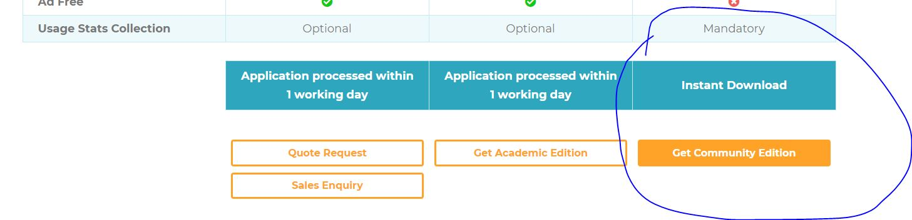
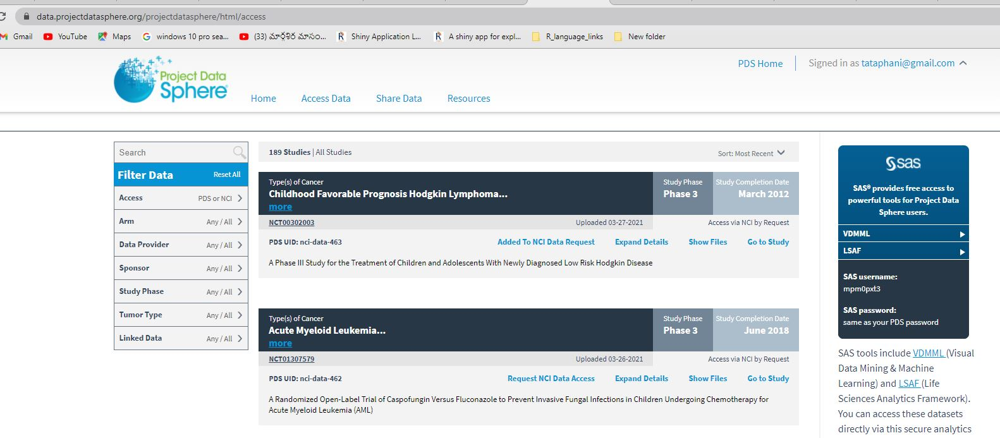
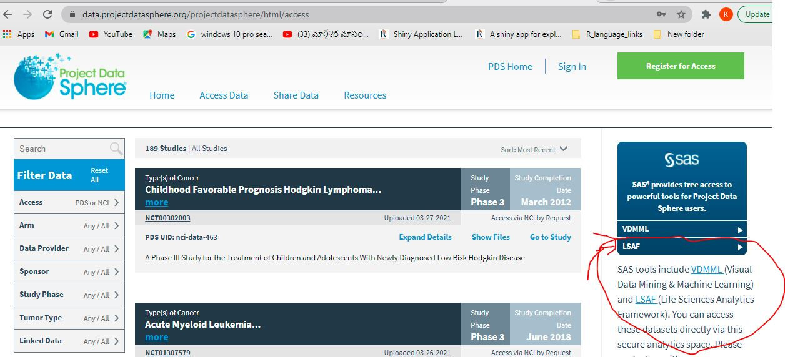
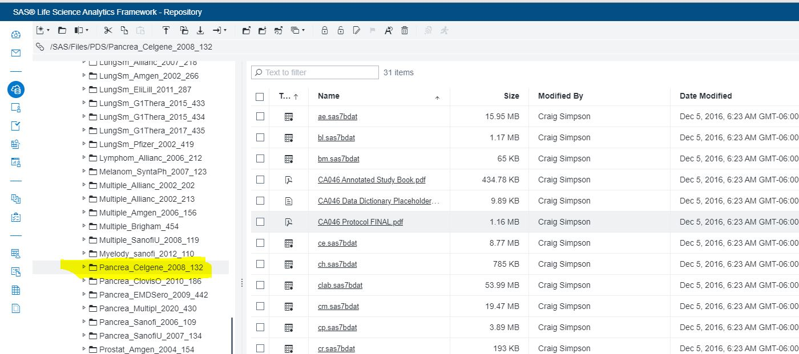
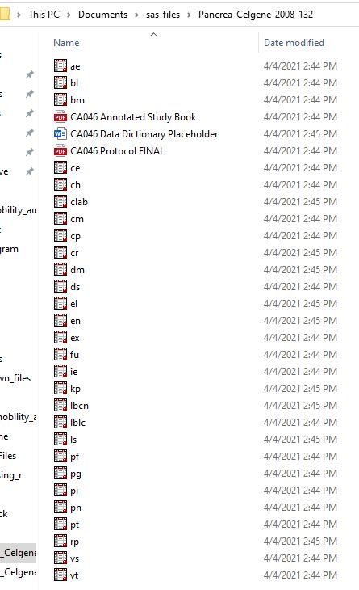

I am a statistical programmer who analyze clinical data using SAS software.Have been working 
more than 12 years using SAS software , which is great tool to analyze the data and very easy
for Data manipulation . Recently I started exploring ways to analyze data available outside the 
work environment, which is client specific. These are the things I ended up finding out 

## How Can I use SAS software for personnel research 
There are couple of ways you can do 

- 1. Download student version of SAS software. For this we need to have Student email ID, which I do not have it 

- 2. Second option is when I reading through the SAS-L found something about World programming 

Using WPS you can read and write SAS language programs exactly way you do it using SAS. I am using for my personnel purposes only  as there was court litigation earlier in UK court and looks like WPS won the case . You can google more about it up 

## How to use WPS

-  Step One 

Register to [worldprogramming ](https://www.worldprogramming.com/){:target = "_blank"}

-  Select  

 

-  then choose

Once you download the .msi file run the .msi file and it will ask you the folder 

 . 

After you have done with installation . Download the License file 

and browse the file using local server. Use the help document . Once 
installation is complete , you can open an untitled program and it would look like this 

Once you have the software is installed

## Clinical data to download

Clinical data at  [Project Data Sphere](https://www.projectdatasphere.org/)

This home for lot's clinical data sets (oncology) , This is the leading oncology data
sharing platform . They host de-identified patient level data contributed by industry, academia and PDS research programs. 

To access the data fist register for access ( usually takes about 3 to 7 days for approval) . Once you get access to the data , you see a page like this 

 

Once you login to the page navigate to access data. Once you reach there there are two ways of accessing data  
To right of the page there is SAS provides free access to Data in two different ways 

-- VDMML 

-- LSAF 

When you click on the link it will ask for the user name is given to you and same password as that of Project sphere login 

VDMML has more tools ( Like SAS Viya , R studio and other tools . ) This is little more complicated to set up ( I have yet to figure it out ) . 

LSAF is straight forward way when you login , you will see a screen like this 

Once you login you see screen like this 

I had a zoom meeting with the people who are coordinators of this site , who told me that the data can be download to your drive and use for research work. 

Only thing that we need to do to use the data is that we need to put them in reference section of the paper . 

Downloaded data looks like this 

