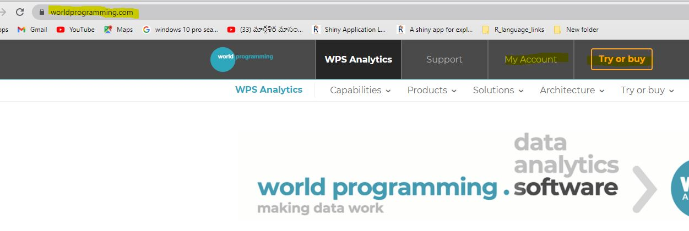
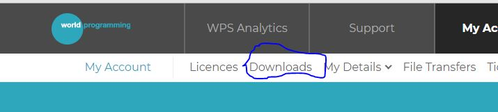
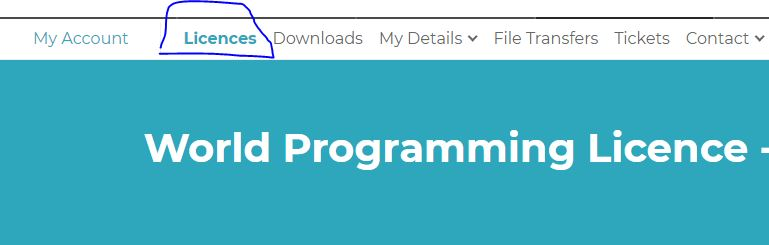

## How Can I use SAS software for personnel research

There are couple of ways you can do

-   

    1.  Download student version of SAS software and set up an virtual environment ( this means that within your computer you will be creating a folder and make it virtual , that way you can't install anything else in that folder) .

You need certain amount of research to install it . Once installed you have lot's of limitations to access external data and number of rows ( There was limitation on number of rows to read)

I did not research further on this option.

-   

    2.  Second option I found on SAS-L discussion about World programming (Short name WPS)

Using WPS you can read and write SAS language programs exactly way you do it using SAS. I am using for my personnel purposes only as there was court litigation earlier in UK court and looks like WPS won the case . You can research more about it up

## How to use WPS

-   Step One

Register to [worldprogramming](https://www.worldprogramming.com/) 

-   Select Downloads

-   then choose

Once you download the .msi file run the .msi file and it will ask you the folder

 .

After you have done with installation . Download the License file

and browse the file using local server. Use the help document . Once installation is complete , you can open an untitled program and it would look like this

Once you have the software is installed

## Clinical data to download

Clinical data at [Project Data Sphere](https://data.projectdatasphere.org/projectdatasphere/html/home)

This home for lot's clinical data sets (oncology) , This is the leading oncology data sharing platform . They host de-identified patient level data contributed by industry, academia and PDS research programs.

To access the data fist register for access ( usually takes about 3 to 7 days for approval) . Once you get access to the data , you see a page like this

navigate to access data. Once you reach there there are two ways of accessing data\
To right of the page there is SAS provides free access to Data in two different ways

-- VDMML

VDMML has more tools ( Like SAS Viya , R link and other tools . ) This is little more complicated to set up ( I have not worked on it yet) .

-- [LSAF](https://pdsprod.ondemand.sas.com/lsaf/)

LSAF is straight forward The way to log on is ,

When you click on the link it will ask for the user name is given to you on the PDS page and same password as that of Project sphere login

On the PDS screen you will see a screen like this

Once you log on to LSAF you see screen like this ,

[ Quick tip is once you login you may see a blank page send an email contact person and they are very quick in responding back ]

I had a zoom meeting with coordinators of this site , who told me that the data can be download to your drive and use for research work.

Only thing that we need to do to use the data is that we need to put them in reference section of the paper .

Downloaded data looks like this

